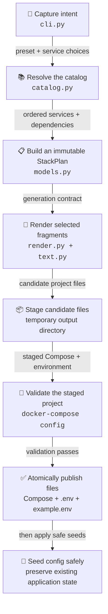

# Maraudarr Architecture 🗺️

Maraudarr separates selection, representation, rendering, validation, and
writing so each boundary can be tested without launching the generated stack.

## Generation Flow

This is the path of one successful Maraudarr generation run, from the user's
service choices to safely published Plundarr files and preserved application
configuration. It describes project generation, not container startup.

## 1. Parse Intent

`maraudarr.cli` accepts an interactive `configure` voyage or a deterministic
`build` command. The CLI normalizes service additions and removals, then writes
normal user-facing output to `dist/<preset>/`; `--output` remains available for
an exact automation directory. It does not decide dependency order or edit
source templates.

## 2. Load and Resolve the Catalog

`Catalog` reads the TOML catalog and validates every referenced Compose,
environment, dependency, recommendation, preset service, project identity,
network default, media root, media library profile, and host-port offset.
`Catalog.resolve` then:

1. Starts with a preset or explicit custom selection.
2. Applies removals and additions.
3. Restores services declared as preset core requirements.
4. Rejects unknown or empty selections.
5. Recursively adds required dependencies.
6. Sorts services by catalog order and stable service ID.

Core services are restored in step 3 and cannot be removed. Default services
are only the preset's initial checkbox state, so users can replace qBittorrent
with a Usenet client or select both without a separate add-on mechanism.

The result is an immutable `StackPlan`. Renderers consume that plan rather than
repeating selection logic.

## 3. Render Without Flattening Intent

The source templates are intentionally readable, commented Compose and
environment fragments. Maraudarr performs narrow text transformations so the
generated deployment retains those comments and unresolved `${VARIABLES}`.

`text.py` locates service declarations, framed environment sections, shared
anchors, and footer blocks. `render.py` combines selected fragments and applies
conditional additions such as Gluetun ports, Homepage cards, preset-aware media
libraries, collision-free project port defaults, and fresh environment values.
Jellyfin remains deliberately invariant: every preset mounts one writable media
root at `/data`.

!!! important

    Replacing this layer with a generic YAML load-and-dump cycle would discard
    comments and weaken the generated file as an operator-facing artifact.

## 4. Preserve Environment State

Existing assignments are indexed by variable name. Selected variables keep
their user-managed lines, temporarily inactive service values move to a marked
footer, and first-run secrets replace placeholders only when no existing value
is available. `COMPOSE_PROJECT_NAME` remains generator-owned so preset identity
cannot drift accidentally.

## 5. Stage, Validate, and Publish Output

Compose and environment files are written to a temporary directory inside the
requested preset directory. Maraudarr asks Docker Compose to validate that
staged pair, then atomically replaces the public files only after validation
succeeds. A missing Docker executable is tolerated for dependency-free source
testing; an installed Docker Compose that rejects the chart is a hard failure.

Config seeding follows a different safety rule: missing seeds are copied,
project-owned README files may be refreshed, and existing application files are
never replaced. Destructive cleanup belongs exclusively to the explicit
`make clean-config` target.

## Failure Boundaries

| Error family    | Meaning                                                                     |
| :-------------- | :-------------------------------------------------------------------------- |
| `CatalogError`  | Invalid catalog data or impossible service selection                        |
| `TemplateError` | A source fragment no longer matches its documented structure                |
| `RenderError`   | Required rendered content is missing or Compose validation failed           |
| `UserCancelled` | An intentional interactive exit, reported with status `130`                 |
| `OSError`       | Filesystem or process failure reported to the user with corrective guidance |
